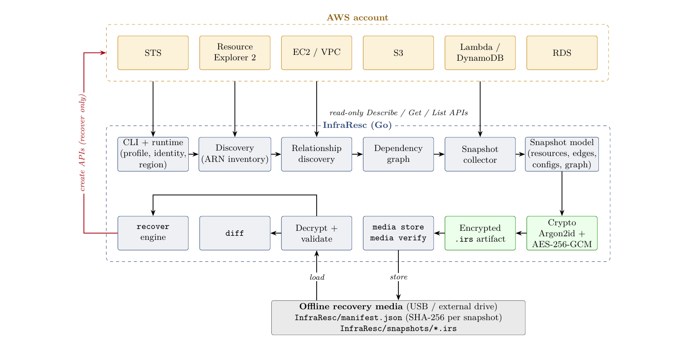

# InfraResc

A Command line interface (CLI) based physical backup and recovery tool for Amazon Web Services [AWS] based cloud infrastructure.

InfraResc discovers AWS infrastructure, creates encrypted snapshots, stores them on portable media, verifies infrastructure state, and recovers missing or changed resources.


## Features

- AWS infrastructure discovery
- Dependency graph generation
- Encrypted infrastructure snapshots
- Physical media support
- Snapshot verification
- Infrastructure diff
- Dependency-aware recovery
- Post-recovery verification

## Installation

Download the latest release from the [Releases](../../releases) page.

The Windows installer checks for AWS CLI v2 and installs it if required.

## Requirements

- Windows 10/11
- AWS account
- AWS CLI v2

## Quick Start
> Note:  Administrator privileges are required to run this program. Please run your powershell or cmd in admin mode.
### 1. Configure InfraResc

Configure your InfraResc authentication settings:

```powershell
infraresc auth configure
```

Follow the prompts to configure the AWS authentication profile used by InfraResc.

### 2. Authenticate with AWS

Start the AWS browser-based authentication flow:

```powershell
infraresc auth login
```

Or use a specific profile:

```powershell
infraresc auth login --profile meow
```

Check your authentication status:

```powershell
infraresc auth status --profile meow
```

### 3. Discover Infrastructure
> Note: InfraResc uses `infraresc` as the default profile. If you are using the default profile, you can omit the `--profile` flag from all commands. The `--profile` option is only required when using a different profile.

Scan the AWS account and discover resources and their relationships:

```powershell
infraresc scan --profile meow
```

### 4. Create an Encrypted Snapshot

Create a snapshot of the discovered infrastructure:

```powershell
infraresc snapshot
```

InfraResc captures resources, relationships, dependencies, and supported resource configuration.

### 5. Store the Snapshot

Store the encrypted `.irs` snapshot on portable physical media:

```powershell
infraresc media store
```

List available media:

```powershell
infraresc media list
```

Inspect stored snapshots:

```powershell
infraresc media inspect
```

### 6. Verify the Backup

Verify the integrity of snapshots stored on physical media:

```powershell
infraresc media verify
```

### 7. Compare Infrastructure

Compare the backed-up infrastructure against the current AWS environment:

```powershell
infraresc diff
```

InfraResc identifies resources that are missing or whose configuration has changed.

### 8. Recover Infrastructure

Recover missing or changed resources from the snapshot:

```powershell
infraresc recover
```

InfraResc validates the snapshot and performs account and region safety checks before starting recovery.

For the complete setup and first-run workflow, see the **[Getting Started](../../wiki/Getting-Started)** guide.


## Documentation

See the [InfraResc Wiki](../../wiki) for installation, usage, recovery, and troubleshooting documentation.

## License

InfraResc is licensed under the Apache License 2.0.

See the [LICENSE](LICENSE) file for the full license text.

## Team

Made with love by team Lavender in Bharat Builds Tour by WeMakeDevs and AWS
